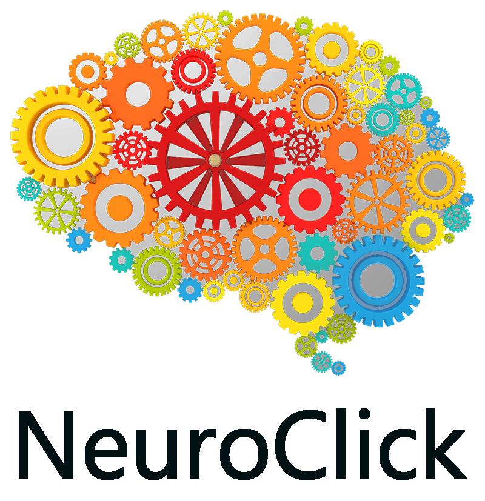

# NEUROCLICK (BACKEND)

## API CON LA QUE CONECTAR LA PARTE FRONTEND (https://github.com/aramossanchez/neuroclick_frontend) Y LA BASE DE DATOS DE LA APLICACIÓN ⛓



## APLICACIÓN PARA LA GESTIÓN DE UNA CLÍNICA DE NEUROREHABILITACIÓN 🧠

Aplicación con la que gestionar los diferentes usuarios y profesionales de una clínica de neurorehabiliación.
Entre las diferentes funciones que tiene la aplicación cabe destacar:
* Login en la aplicación.
* Existencia de diferentes roles dentro de la aplicación (admin, Administración, y profesionales encargados de los tratamientos a los usuarios).
* La posibilidad de dejar guardados los resultados de las pruebas estandarizadas realizadas al usuario, por cada tipo de profesional trabajando en la clínica (Fisioterapia, Terapia Ocupacional, Neuropsicología y Logopedia).
* La posibilidad de que cualquier profesional (de los mencionados anteriormente) pueda acceder al histórico de cada una de las pruebas realizadas a cualquier usuario.
* La limitación de crear nuevas pruebas solamente del mismo tipo de profesional logado en la aplicación.
* Solo los profesionales con perfil de Administración podrán editar los datos de los usuarios, así como dar de alta a nuevos usuarios y profesionales, pero no tendrán acceso a las pruebas.
* El usuario con perfil de admin tendrá acceso a todas las tablas de la base de datos. Podrá crear registros nuevos y leer, modificar y borrar los registros ya existentes.

## TECNOLOGÍAS UTILIZADAS 🔨
* express
* nodemon
* bcrypt
* cors
* jsonwebtoken
* mysql2
* sequelize

## REQUISITOS PARA HACERLO FUNCIONAR EN UN EQUIPO LOCAL 💻
* Es necesario tener instalado en el equipo **Nodejs**. Si no lo está, se puede descargar de su página oficial https://nodejs.org/
* Clonar el proyecto en nuestro equipo con git bash:
```
$git clone 'url-del-repositorio'
```
* Instalar todas las dependecias con el siguiente comando:
```
npm install
```
* Arrancamos el servidor con el siguiente comando:
```
npm run start
```

## URL DE DEPLOY 💥
enlace
